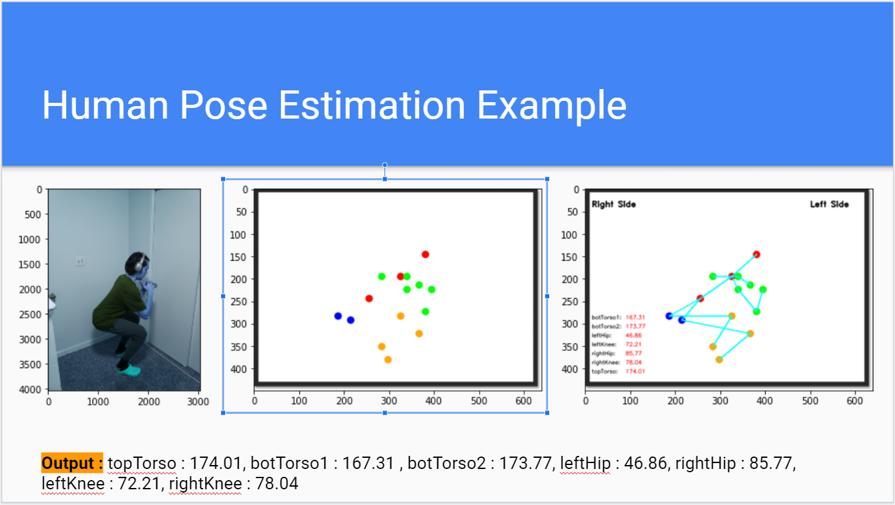

# MLFitness
<h2 aligh="center">Authors : Antonio Gutierrez and Keeven Savanathan </h2>
A machine learning project project for our USF CS 486-04 Machine Learning class.

<h2 aligh="center">Goal</h2>
The goal of MLFitness is to classify a good squat or bad squat.
We created data and got some off Google.  
We classified a good squat based on the depth and safety of it (if back was rounded or not).

Our program calculates angles based off the points of major joints predicted from each photo using Human Pose Estimation.

<h2 aligh="center">This is an example of how our program works: </h2>

We first take a picture of a squat, then we calculate the points of the joints using HPE, and finally create angles as output.

To replicate this project, please follow the instructions at : https://www.learnopencv.com/deep-learning-based-human-pose-estimation-using-opencv-cpp-python/ in order to get the pretrained models loaded and working.

<h2 aligh="center">Data:</h2> 
Our data lies in our "data" folder and good squats are labled as "gs(#of pic)" and bad squats are labeled as "bs(#of pic)".
We have original data, pictures taken of ourselves and friends, as well as some data found from Google.

<h2 aligh="center">Credit: </h2>
We referenced and used code from: https://github.com/kunjshah2511/Human-Pose-Estimation

Many thanks!
